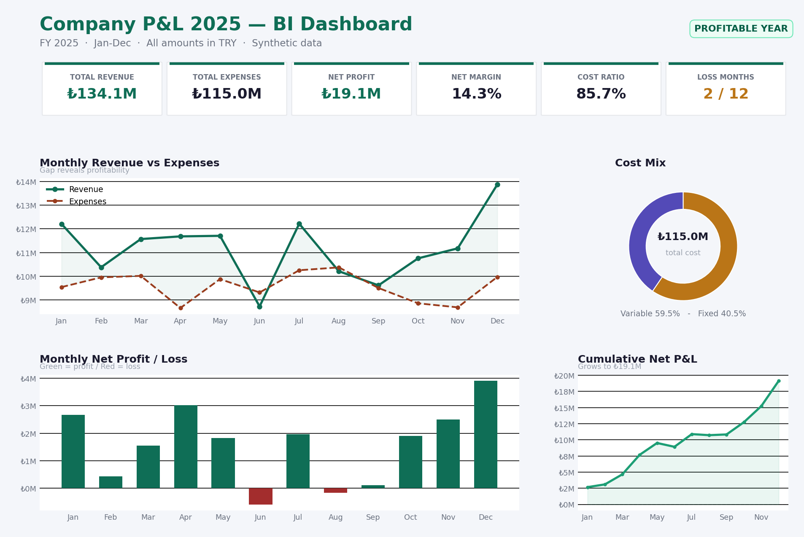

# Company P&L 2025 — FP&A BI Dashboard

An end-to-end **financial planning & analysis (FP&A)** project that follows one dataset
through the full analytical chain: from a transaction-level fact table, to a structured
**P&L statement with a live ratios model**, to an interactive business-intelligence
dashboard. Built to demonstrate the core FP&A workflow — structuring financial data,
building the P&L bridge, computing the ratios that explain performance, and communicating
the result to leadership.

The story runs in three layers, each in its own file:

1. **Raw model** — a fact table of monthly line items (`Company_PL_2025_PowerBI_Synthetic.xlsx`).
2. **P&L & ratios** — a formula-driven workbook that turns those line items into a monthly
   P&L bridge and a full set of profitability, cost-structure, and break-even ratios
   (`PL_Ratios_Analysis_2025.xlsx`).
3. **Dashboard** — the same numbers told visually for a leadership audience (`PL_Dashboard_Synthetic_2025.*`).

> **Note on the data:** All figures are **synthetic** data generated to demonstrate
> methodology. No confidential or company-owned information is included. Amounts are in
> Turkish Lira (₺ / TRY).



---

## The headline

For FY 2025 the modelled company is **profitable in 10 of 12 months**, closing the year with:

| Metric | Value | Definition |
|---|---|---|
| Total revenue | **₺134.1M** | Annual gross sales |
| Total expenses | **₺115.0M** | Variable + fixed |
| Net profit | **₺19.1M** | Revenue − expenses |
| Net margin | **14.3%** | Net profit / revenue |
| Cost ratio | **85.7%** | Expenses / revenue |
| Loss months | **2 / 12** | June & August (minor) |

Cost base is **59.5% variable / 40.5% fixed**. Profit accelerates through Q4 (best quarter,
net ₺8.3M); Q3 is the weakest (net ₺1.9M), pressured by two small monthly losses.

---

## What this project demonstrates

- **Financial data modelling** — a clean, star-schema-friendly fact table (`PBI_Fact_PL`)
  with dimensions for period, line item, account code, cost type, and department.
- **P&L structuring** — revenue, variable / semi-variable / fixed costs, and total rows,
  organised to avoid double-counting via an `Is_Total_Row` flag.
- **KPI & measure design** — Total Revenue, Total Expenses, Net Profit, Net Margin,
  cost ratio (DAX definitions included).
- **Variance & profitability analysis** — month-over-month net P&L, quarterly breakdown,
  and cumulative profit tracking against break-even.
- **Data storytelling** — a self-contained dashboard that leads with the answer, then
  supports it with trend, mix, and cumulative views.

---

## Repository structure

```
manufacturing-margin-intelligence/
├── README.md                                ← you are here
├── Company_PL_2025_PowerBI_Synthetic.xlsx   ← source model (fact + summary + setup guide)
├── PL_Ratios_Analysis_2025.xlsx             ← P&L statement + live ratios model (3 tabs)
├── PL_Dashboard_Synthetic_2025.html         ← interactive dashboard (open in a browser)
├── PL_Dashboard_Synthetic_2025.pdf          ← static export for quick viewing
├── dashboard_preview.png                    ← preview image used above
├── DATA_DICTIONARY.md                       ← field definitions & modelling notes
├── .gitignore
└── LICENSE
```

## How to view it

- **Fastest:** open [`PL_Dashboard_Synthetic_2025.pdf`](PL_Dashboard_Synthetic_2025.pdf).
- **The numbers behind the charts:** open
  [`PL_Ratios_Analysis_2025.xlsx`](PL_Ratios_Analysis_2025.xlsx) —
  the P&L statement and every ratio the dashboard visualises, as a working model.
- **Interactive:** download and open [`PL_Dashboard_Synthetic_2025.html`](PL_Dashboard_Synthetic_2025.html)
  in any browser — charts are rendered with Chart.js, no install required.
- **Rebuild in Power BI:** open the workbook and follow the `PBI_Setup_Guide` tab
  (summarised in [`DATA_DICTIONARY.md`](DATA_DICTIONARY.md)).

---

## The data model (source workbook)

The Excel file contains three tabs:

| Tab | Rows | Purpose |
|---|---|---|
| `PBI_Fact_PL` | 432 | Transaction-grain fact table — one row per line item × month |
| `PBI_Monthly_Summary` | 7 | Pre-aggregated monthly P&L for quick reference / QA |
| `PBI_Setup_Guide` | — | Step-by-step Power BI connection, data types, DAX, and visual guide |

### Key DAX measures

```DAX
Total Revenue  = CALCULATE(SUM(PBI_Fact_PL[Amount_TRY]),
                    PBI_Fact_PL[Category] = "Revenue",
                    PBI_Fact_PL[Is_Total_Row] = FALSE)

Total Expenses = CALCULATE(SUM(PBI_Fact_PL[Amount_TRY]),
                    PBI_Fact_PL[Category] = "Expenses Total")

Net Profit     = [Total Revenue] - [Total Expenses]

Net Margin %   = DIVIDE([Net Profit], [Total Revenue])
```

> **Modelling note:** filter `Is_Total_Row = FALSE` for detail-level visuals to avoid
> double-counting subtotal rows.

---

## The P&L & ratios model

[`PL_Ratios_Analysis_2025.xlsx`](PL_Ratios_Analysis_2025.xlsx) is the
analytical core between the raw data and the dashboard — a fully formula-driven workbook
(no hardcoded results) with three tabs:

| Tab | What it holds |
|---|---|
| **Summary** | Executive cover — headline KPIs and a quarterly breakdown, all linked to the P&L tab |
| **P&L Statement** | Monthly P&L bridge (Jan–Dec + FY): Revenue → Variable costs → **Contribution Margin** → Fixed costs → **Net Profit**, with net-margin and cumulative rows |
| **Ratios** | Every ratio computed live: profitability margins, cost-structure ratios, MoM growth, and break-even / margin-of-safety |

It reads as a proper P&L bridge rather than a flat table:

```
Revenue                         ₺134.1M
  − Variable costs              ₺68.4M   (COGS + semi-variable + variable finance)
  = Contribution Margin         ₺65.7M   → 49.0% of revenue
  − Fixed costs                 ₺46.6M
  = Net Profit                  ₺19.1M   → 14.3% net margin
```

The workbook is built to be **driven, not just read**: only the monthly line-item cells are
inputs (marked in blue), and every subtotal, margin, quarter, and KPI recalculates from them.
Change an input and the whole model — and the story it tells — updates. Selected FY ratios:

| Ratio | FY 2025 | Reading |
|---|---|---|
| Gross margin (ex-COGS) | **69.1%** | Strong product-level economics |
| Contribution margin | **49.0%** | Nearly half of each ₺ covers fixed costs + profit |
| Net profit margin | **14.3%** | Healthy bottom line |
| Cost ratio | **85.7%** | Room to reinvest |
| Variable / fixed cost split | **59.5% / 40.5%** | Cost base flexes with volume |
| Break-even revenue | **₺95.1M** | 29.1% margin of safety on FY revenue |

---

## Tools & skills

`Excel / Power Query` · `Power BI (star schema, DAX)` · `Financial modelling` ·
`P&L bridge & ratio analysis` · `Break-even / contribution margin` · `Variance analysis` ·
`Data visualisation (Chart.js)` · `Dashboard design`

## License

Released under the [MIT License](LICENSE). Data is synthetic and free to reuse.
